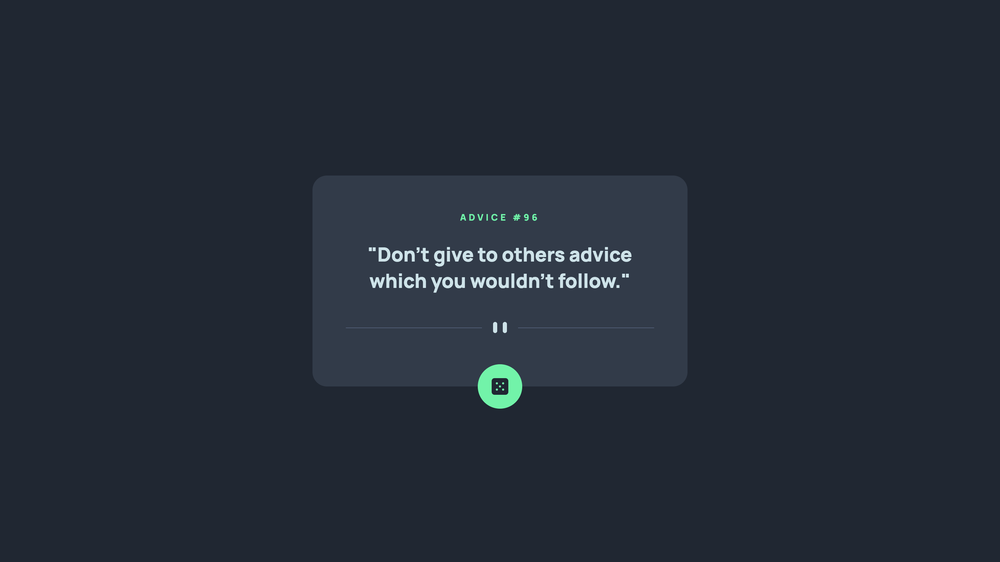
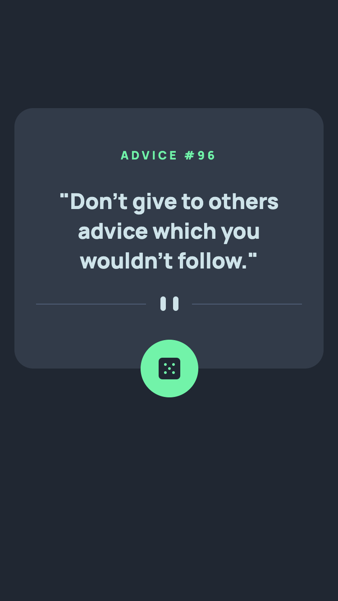

# Frontend Mentor - Advice generator app solution

This is a solution to the [Advice generator app challenge on Frontend Mentor](https://www.frontendmentor.io/challenges/advice-generator-app-QdUG-13db). Frontend Mentor challenges help you improve your coding skills by building realistic projects.

## Table of contents

- [Overview](#overview)
  - [The challenge](#the-challenge)
  - [Screenshot](#screenshot)
  - [Links](#links)
- [My process](#my-process)
  - [Built with](#built-with)
  - [What I learned](#what-i-learned)
  - [Useful resources](#useful-resources)
- [Author](#author)


## Overview

### The challenge

Users should be able to:

- View the optimal layout for the app depending on their device's screen size
- See hover states for all interactive elements on the page
- Generate a new piece of advice by clicking the dice icon

### Screenshot





### Links

- Solution URL: [Solution](https://github.com/andyjv1/Advice-generator-app.git)
- Live Site URL: [Live](https://voluble-tarsier-3462ac.netlify.app/)

## My process

### Built with

- Semantic HTML5 markup
- CSS custom properties
- Flexbox
- Mobile-first workflow
- React


### What I learned

I learned a lot in this small project. first i learn how to interact with 3rd-party APIs for the first time. This is a great project to get introduced to this. I also learned how to use useEffect, useState and props for this project. Finally, i learned how to use disabled to disabled the button for two seconds after it is clicked.


```css
button:disabled {
  background-color: grey;
}
```
```js
 const fetchAdviceClicked = async () => {
    const API_LINK = "https://api.adviceslip.com/advice";
    const response = await fetch(API_LINK);
    const advice = await response.json();
    props.setText(advice.slip)
    setDisabled(true)
    setTimeout(() => setDisabled(false), 2000);
  };

  <Text
    Id={text.id}
    adviceText={text.advice}
  />
```

### Useful resources

- [Using the State Hook](https://legacy.reactjs.org/docs/hooks-state.html) - This help me learn how to use usestate so i can disable the button and render the advice.
- [Using the Effect Hook](https://legacy.reactjs.org/docs/hooks-effect.html) - This help me learn how to use useEffect so an advice can be render when the page is opened for the first time.
- [Render Props](https://legacy.reactjs.org/docs/render-props.html#gatsby-focus-wrapper) - This help me learn how to use the advice and the advice id to the Text component.
## Author

- Frontend Mentor - [@andyjv1](https://www.frontendmentor.io/profile/andyjv1)


